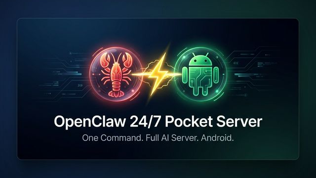

<p align="center">
  
</p>
<h1 align="center">OpenClaw on Android (OCA)</h1>

<p align="center">
  <b>Turn any Android phone into a 24/7 AI server — one command, zero hassle.</b><br/>
  No proot, no Ubuntu, pure Termux.
</p>

<p align="center">
  <a href="https://github.com/PsProsen-Dev/OpenClaw-On-Android/releases">
    
  </a>
  <a href="https://github.com/PsProsen-Dev/OpenClaw-On-Android/blob/main/LICENSE">
    
  </a>
  <a href="https://github.com/PsProsen-Dev/OpenClaw-On-Android/discussions">
    
  </a>
</p>

---

## 📖 Documentation

Read the complete guides and setup instructions on our **[Mintlify Documentation site](docs/)**.

* [Installation Guide](docs/installation.mdx)
* [Configuration & Setup](docs/configuration.mdx)
* [Troubleshooting](docs/troubleshooting.mdx)
* [SSH Remote Setup](docs/ssh-guide.mdx)

---

## 📺 Media & Articles

Learn more about the technology behind OCA and the power of on-device AI!

- 📰 **Blog:** [Nano Banana Pro in Google Antigravity](https://antigravity.google/blog/nano-banana-pro-in-google-antigravity)
- 📰 **Blog:** [Introducing Google Antigravity](https://antigravity.google/blog/introducing-google-antigravity)
- 📰 **Blog:** [Gemini 3.1 Pro in Google Antigravity](https://antigravity.google/blog/gemini-3-1-pro-in-google-antigravity)
- 🎥 **Video:** [Watch on YouTube](https://youtu.be/FB6HO7CZHWw)

---

## 💡 The Idea

Your old Android phone? It's a powerful ARM server waiting to happen. OCA installs OpenClaw directly on Termux with glibc compatibility — no Linux distribution needed.

**What you get:**
- ☁️ OpenClaw AI gateway natively on your phone
- 🔧 Full Node.js v24 environment (glibc, not Bionic)
- 🛠️ AI CLI tools (Claude Code, Gemini, Codex, Qwen Code, OpenCode)
- 🌐 Browser IDE (code-server)
- 📱 SSH access + auto-start on boot
- 🔐 Root access integration (for rooted devices)

---

## 🚀 Quick Start

Launch Termux and run the installer:

```bash
curl -sL https://raw.githubusercontent.com/PsProsen-Dev/OpenClaw-On-Android/master/bootstrap.sh | bash && source ~/.bashrc
```

The installer will prompt you to install optional tools (like SSH, Qwen Code CLI, Termux:API, and Termux:Boot). Follow the on-screen instructions.

---

## ⚙️ How It Works

The installer bridges Termux (Bionic libc) and standard Linux (glibc):

1. **glibc-runner** provides `ld-linux-aarch64.so.1` via pacman
2. **Node.js v24** (linux-arm64) runs through a wrapper script that uses `ld.so`
3. **Path patches** rewrite `/tmp`, `/bin/sh`, `/usr/bin/env` to Termux equivalents
4. **glibc-compat.js** fixes Android kernel quirks (`os.cpus()`, `os.networkInterfaces()`)

---

## 🛑 Android 12+ — Kill Phantom Process Killer

Android 12+ aggressively kills background processes (`[Process completed (signal 9)]`). Fix it once:

```bash
# Connect to ADB from PC
adb shell "settings put global settings_enable_monitor_phantom_procs false"
```

---

## 🙏 Credits

Inspired by [AidanPark/openclaw-android](https://github.com/AidanPark/openclaw-android).
Built by **[PsProsen-Dev](https://github.com/PsProsen-Dev)** ⚡

## 📄 License
MIT License — see [LICENSE](LICENSE) for details.
